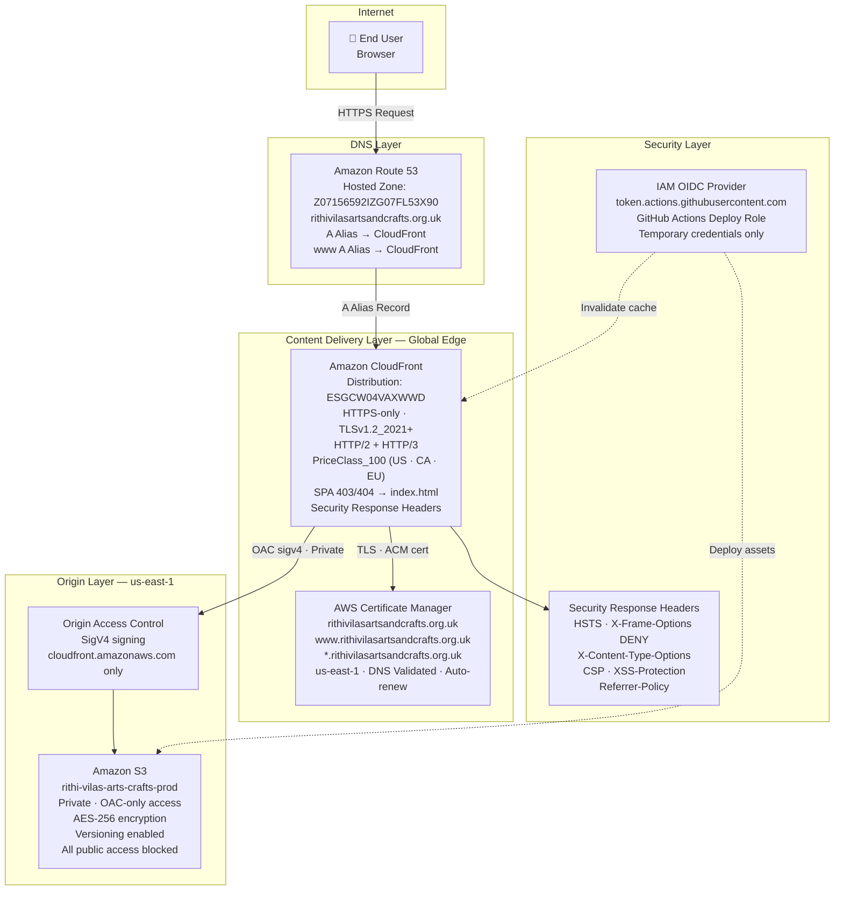
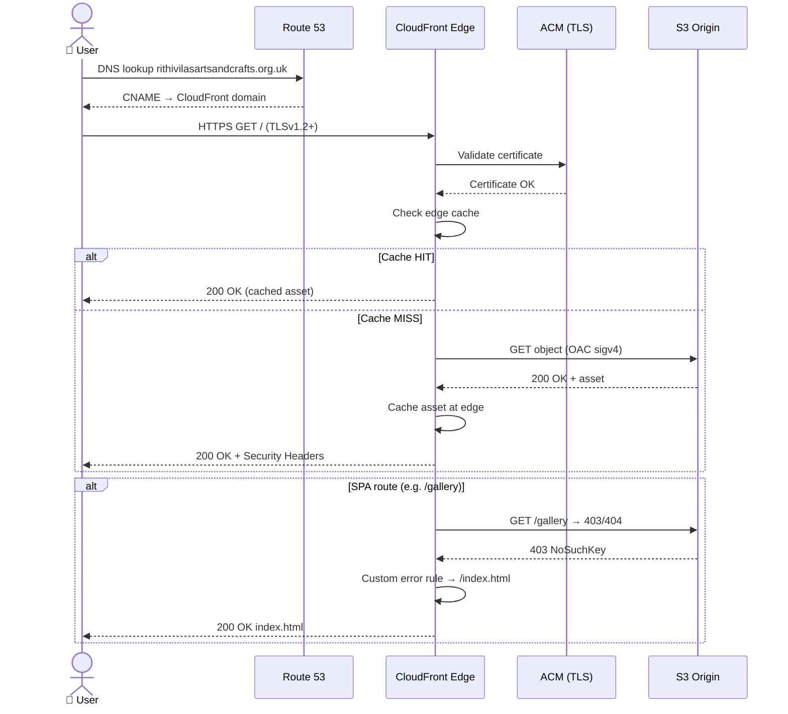
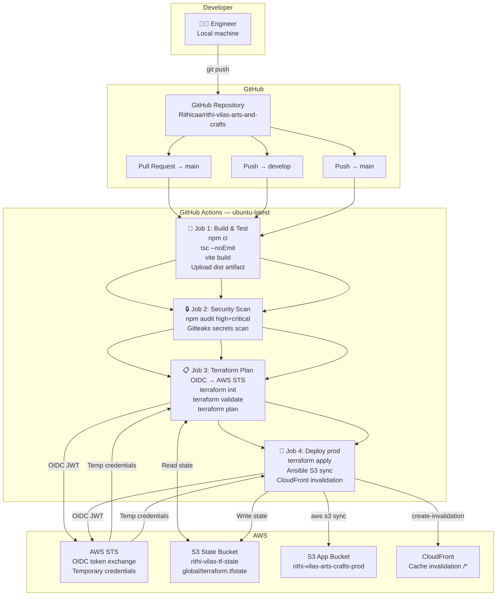
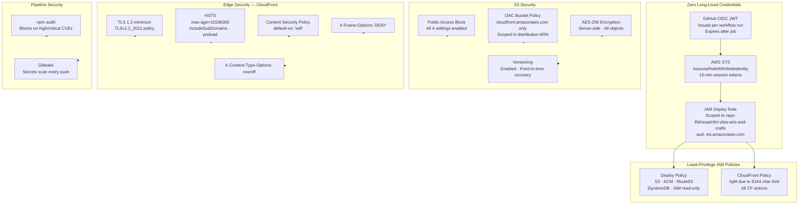
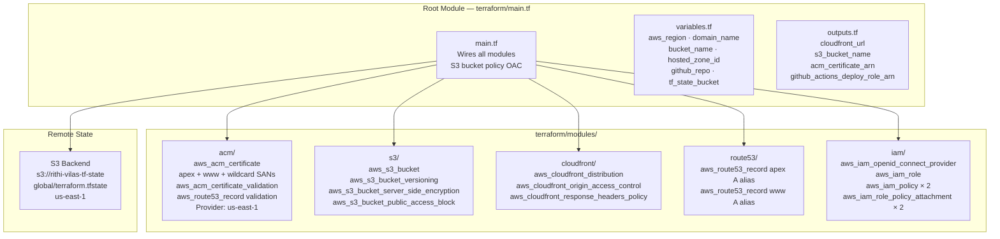
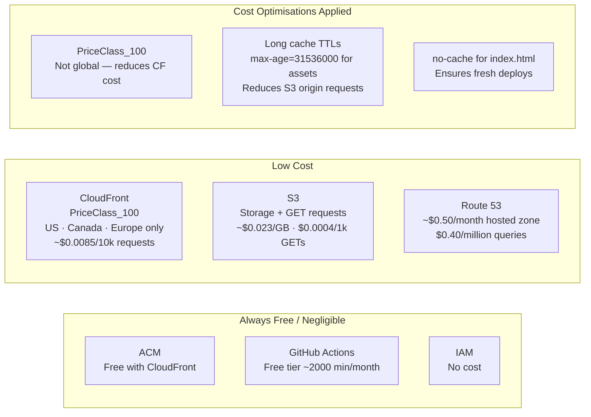

# AWS Reference Architecture — High Level Design
## Rithi Vilas Arts and Crafts

---

## 1. Architecture Overview

---

## 2. Network & Traffic Flow

---

## 3. CI/CD Pipeline Architecture

---

## 4. Security Architecture

---

## 5. Terraform Infrastructure Modules

---

## 6. Cost Architecture

---

## 7. Disaster Recovery

| Scenario | Recovery Steps | RTO |
|---|---|---|
| Bad deploy (wrong assets in S3) | `aws s3 sync` previous build to S3 + CloudFront invalidation | < 5 min |
| Terraform state corruption | Restore from `rithi-vilas-tf-state` versioned state file | < 15 min |
| CloudFront distribution misconfigured | `terraform apply` to restore known-good config | < 10 min |
| ACM certificate expired | Auto-renews via DNS validation — no action needed | N/A |
| S3 object accidentally deleted | Restore from S3 versioning | < 5 min |
| Full infrastructure teardown | Re-run bootstrap steps + `terraform apply` | < 30 min |

---

## 8. Key AWS Resource Inventory

| Service | Resource | ID / ARN |
|---|---|---|
| Route 53 | Hosted Zone | `Z07156592IZG07FL53X90` |
| ACM | Certificate | `*.rithivilasartsandcrafts.org.uk` · us-east-1 |
| CloudFront | Distribution | `ESGCW04VAXWWD` |
| S3 | App Bucket | `rithi-vilas-arts-crafts-prod` |
| S3 | State Bucket | `rithi-vilas-tf-state` |
| IAM | OIDC Provider | `token.actions.githubusercontent.com` |
| IAM | Deploy Role | `arn:aws:iam::231921252815:role/rithi-vilas-arts-and-crafts-github-actions-deploy` |
| IAM | Deploy Policy | `rithi-vilas-arts-and-crafts-github-actions-deploy-policy` |
| IAM | CloudFront Policy | `rithi-vilas-arts-and-crafts-github-actions-cloudfront-policy` |
