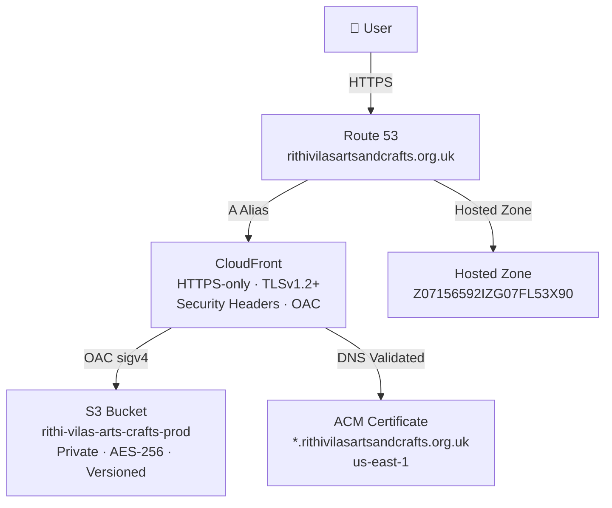
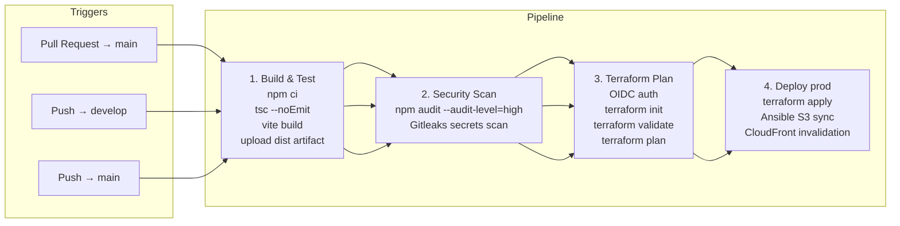
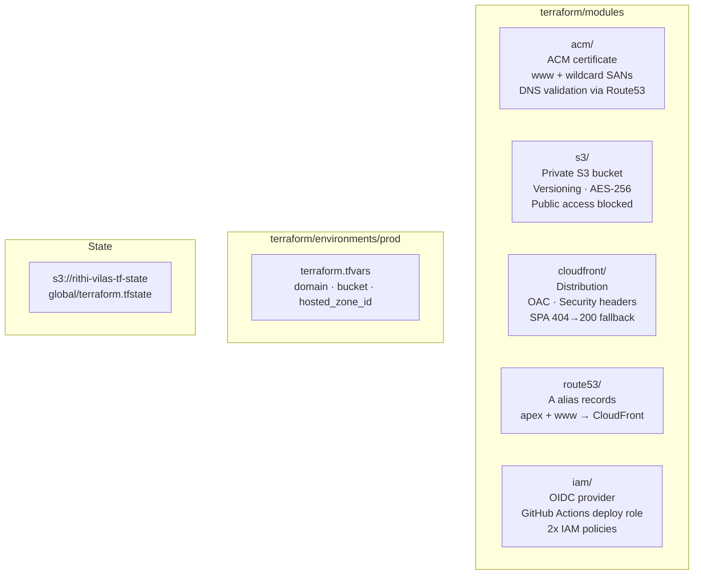
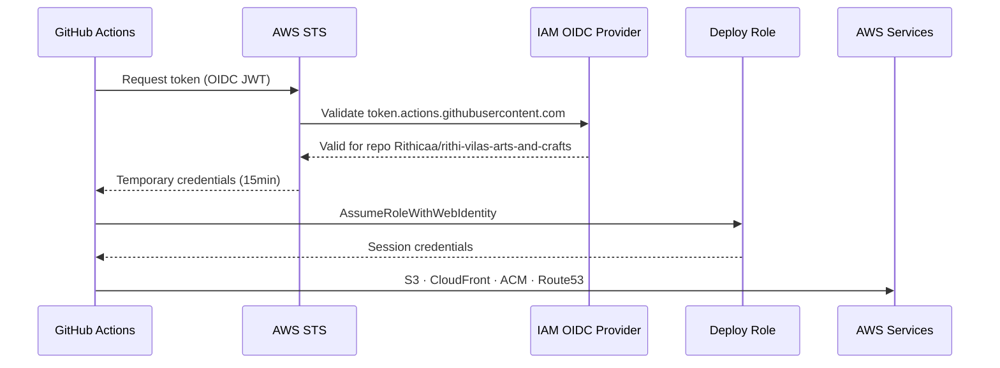

# Rithi Vilas Arts and Crafts — Engineering Runbook

## Table of Contents
1. [Architecture Overview](#architecture-overview)
2. [CI/CD Pipeline](#cicd-pipeline)
3. [Infrastructure](#infrastructure)
4. [IAM & Security](#iam--security)
5. [Terraform State](#terraform-state)
6. [Local Development](#local-development)
7. [Bootstrap (First Time Setup)](#bootstrap-first-time-setup)
8. [Day-to-Day Operations](#day-to-day-operations)
9. [Troubleshooting](#troubleshooting)
10. [Key Resources](#key-resources)

---

## Architecture Overview



---

## CI/CD Pipeline



### Pipeline jobs breakdown

| Job | Runs on | Needs | What it does |
|---|---|---|---|
| Build & Test | all triggers | — | `npm ci` → type check → `vite build` → upload `dist/` artifact |
| Security Scan | all triggers | build | `npm audit --audit-level=high` + Gitleaks secrets scan |
| Terraform Plan | all triggers | security-scan | OIDC auth → `terraform init` → `validate` → `plan` |
| Deploy (prod) | push to `main` or `develop` | build + terraform-plan | `terraform apply` → Ansible S3 sync → CloudFront invalidation |

### GitHub Actions secrets required

| Secret | Value |
|---|---|
| `AWS_DEPLOY_ROLE_ARN` | `arn:aws:iam::231921252815:role/rithi-vilas-arts-and-crafts-github-actions-deploy` |
| `TF_STATE_BUCKET` | `rithi-vilas-tf-state` |
| `CLOUDFRONT_DISTRIBUTION_ID` | CloudFront distribution ID (e.g. `ESGCW04VAXWWD`) |

> `AWS_REGION` is hardcoded to `us-east-1` in the pipeline — not a secret.

---

## Infrastructure



### Terraform modules

| Module | Resources created |
|---|---|
| `acm` | ACM certificate (apex + www + wildcard), Route53 DNS validation records |
| `s3` | S3 bucket, versioning, AES-256 encryption, public access block |
| `cloudfront` | CloudFront distribution, OAC, response headers policy |
| `route53` | A alias records for apex and www pointing to CloudFront |
| `iam` | OIDC provider, GitHub Actions deploy role, 2 IAM policies |

### S3 bucket policy (OAC)

The bucket policy is defined in `terraform/main.tf` (not inside the S3 module) to avoid a circular dependency between S3 and CloudFront. It allows only CloudFront OAC to `s3:GetObject`, scoped to the exact distribution ARN.

---

## IAM & Security



### IAM policies attached to deploy role

Two policies are used (split to stay under the 6144 character IAM policy size limit):

**`rithi-vilas-arts-and-crafts-github-actions-deploy-policy`**
- S3 — full access to app buckets + TF state bucket
- ACM — certificate management
- Route53 — DNS record management
- DynamoDB — Terraform state locking
- IAM — read-only (plan only, no privilege escalation)

**`rithi-vilas-arts-and-crafts-github-actions-cloudfront-policy`**
- CloudFront — full distribution + OAC + response headers policy management

> No long-lived AWS credentials are stored anywhere. GitHub exchanges a short-lived OIDC JWT for temporary STS credentials at runtime.

---

## Terraform State

| Key | Purpose |
|---|---|
| `s3://rithi-vilas-tf-state/global/terraform.tfstate` | Single state file for all infrastructure |

**Important:** All environments (develop + main branches) share `global/terraform.tfstate`. This prevents IAM resources from being recreated on every pipeline run since IAM is account-wide, not environment-specific.

### State bucket properties
- Versioning enabled (recover previous states)
- AES-256 encryption
- All public access blocked

---

## Local Development

### Prerequisites

| Tool | Version |
|---|---|
| Node.js | 22 (use `nvm use 22`) |
| npm | >= 10 |
| Terraform | >= 1.5 (installed via `brew install hashicorp/tap/terraform`) |
| AWS CLI | >= 2 |
| Ansible | >= 2.14 (`pip install ansible boto3`) |

### Run the app locally

```bash
npm install
npm run dev
```

### Type check and build

```bash
npx tsc --noEmit
npm run build
```

### AWS profile

All local AWS operations use the `RithiAI` profile:

```bash
export AWS_PROFILE=RithiAI
unset AWS_ACCESS_KEY_ID AWS_SECRET_ACCESS_KEY AWS_SESSION_TOKEN
```

---

## Bootstrap (First Time Setup)

This only needs to be done once when setting up a brand new AWS account or after a full teardown.

### 1. Create Terraform state bucket

```bash
export AWS_PROFILE=RithiAI

aws s3api create-bucket \
  --bucket rithi-vilas-tf-state \
  --region us-east-1

aws s3api put-bucket-versioning \
  --bucket rithi-vilas-tf-state \
  --versioning-configuration Status=Enabled

aws s3api put-public-access-block \
  --bucket rithi-vilas-tf-state \
  --public-access-block-configuration \
  "BlockPublicAcls=true,IgnorePublicAcls=true,BlockPublicPolicy=true,RestrictPublicBuckets=true"

aws s3api put-bucket-encryption \
  --bucket rithi-vilas-tf-state \
  --server-side-encryption-configuration \
  '{"Rules":[{"ApplyServerSideEncryptionByDefault":{"SSEAlgorithm":"AES256"}}]}'
```

### 2. Bootstrap IAM (OIDC provider + deploy role)

```bash
cd terraform

unset AWS_ACCESS_KEY_ID AWS_SECRET_ACCESS_KEY AWS_SESSION_TOKEN
export AWS_PROFILE=RithiAI

terraform init \
  -backend-config="bucket=rithi-vilas-tf-state" \
  -backend-config="key=global/terraform.tfstate" \
  -backend-config="region=us-east-1"

terraform apply \
  -var-file="environments/prod/terraform.tfvars" \
  -target=module.iam \
  -auto-approve

terraform output github_actions_deploy_role_arn
```

### 3. Add GitHub Actions secrets

Go to **https://github.com/Rithicaa/rithi-vilas-arts-and-crafts/settings/secrets/actions** and add:

| Secret | Value |
|---|---|
| `AWS_DEPLOY_ROLE_ARN` | ARN from step 2 output |
| `TF_STATE_BUCKET` | `rithi-vilas-tf-state` |
| `CLOUDFRONT_DISTRIBUTION_ID` | Add after first full pipeline run |

### 4. Push to trigger full pipeline

```bash
git push origin main
```

After the pipeline completes, get the CloudFront distribution ID:

```bash
terraform output cloudfront_url
```

Add `CLOUDFRONT_DISTRIBUTION_ID` to GitHub secrets.

---

## Day-to-Day Operations

### Deploy a change

```bash
# Make your changes
git add .
git commit -m "feat: your change"
git push origin main   # triggers full pipeline
```

### Run Terraform locally

```bash
cd terraform

unset AWS_ACCESS_KEY_ID AWS_SECRET_ACCESS_KEY AWS_SESSION_TOKEN
export AWS_PROFILE=RithiAI

terraform init \
  -backend-config="bucket=rithi-vilas-tf-state" \
  -backend-config="key=global/terraform.tfstate" \
  -backend-config="region=us-east-1"

terraform plan -var-file="environments/prod/terraform.tfvars"
terraform apply -var-file="environments/prod/terraform.tfvars"
```

### Update IAM permissions

IAM cannot be updated by the pipeline (to prevent privilege escalation). Always apply IAM changes locally:

```bash
terraform apply \
  -var-file="environments/prod/terraform.tfvars" \
  -target=module.iam \
  -auto-approve
```

### Manual CloudFront invalidation

```bash
export AWS_PROFILE=RithiAI

aws cloudfront create-invalidation \
  --distribution-id ESGCW04VAXWWD \
  --paths "/*"
```

### Manual S3 sync

```bash
export AWS_PROFILE=RithiAI

npm run build

aws s3 sync dist/ s3://rithi-vilas-arts-crafts-prod/ \
  --delete \
  --cache-control "public, max-age=31536000, immutable" \
  --exclude "index.html"

aws s3 cp dist/index.html s3://rithi-vilas-arts-crafts-prod/index.html \
  --cache-control "no-cache, no-store, must-revalidate" \
  --content-type "text/html"
```

---

## Troubleshooting

### Pipeline: `AccessDenied` on AWS action

The IAM policy size limit (6144 chars) may have caused truncation. Verify the live policy:

```bash
export AWS_PROFILE=RithiAI

aws iam get-policy-version \
  --policy-arn arn:aws:iam::231921252815:policy/rithi-vilas-arts-and-crafts-github-actions-deploy-policy \
  --version-id $(aws iam get-policy \
    --policy-arn arn:aws:iam::231921252815:policy/rithi-vilas-arts-and-crafts-github-actions-deploy-policy \
    --query 'Policy.DefaultVersionId' --output text) \
  --query 'PolicyVersion.Document.Statement[].Action[]' \
  --output json
```

Then apply the IAM module locally to update it.

### Pipeline: `EntityAlreadyExists` for IAM resources

The global state is empty but resources exist in AWS. Import them:

```bash
cd terraform && export AWS_PROFILE=RithiAI

terraform import -var-file="environments/prod/terraform.tfvars" \
  module.iam.aws_iam_openid_connect_provider.github \
  arn:aws:iam::231921252815:oidc-provider/token.actions.githubusercontent.com

terraform import -var-file="environments/prod/terraform.tfvars" \
  module.iam.aws_iam_role.github_actions_deploy \
  rithi-vilas-arts-and-crafts-github-actions-deploy
```

### Site returns 403

The S3 bucket policy OAC condition may not match the CloudFront distribution ARN. Verify:

```bash
export AWS_PROFILE=RithiAI

aws s3api get-bucket-policy \
  --bucket rithi-vilas-arts-crafts-prod \
  --query 'Policy' --output text | python3 -m json.tool
```

The `AWS:SourceArn` condition must match the CloudFront distribution ARN exactly.

### Terraform state drift

If resources exist in AWS but not in state, use `terraform import`. If resources are in state but deleted in AWS, use `terraform state rm`.

```bash
# Remove a resource from state without destroying it
terraform state rm <resource_address>

# List all resources in state
terraform state list
```

---

## Key Resources

| Resource | Value |
|---|---|
| Domain | `rithivilasartsandcrafts.org.uk` |
| Hosted Zone ID | `Z07156592IZG07FL53X90` |
| AWS Account ID | `231921252815` |
| AWS Region | `us-east-1` |
| S3 App Bucket | `rithi-vilas-arts-crafts-prod` |
| S3 State Bucket | `rithi-vilas-tf-state` |
| TF State Key | `global/terraform.tfstate` |
| CloudFront Distribution | `ESGCW04VAXWWD` |
| Deploy Role ARN | `arn:aws:iam::231921252815:role/rithi-vilas-arts-and-crafts-github-actions-deploy` |
| GitHub Repo | `https://github.com/Rithicaa/rithi-vilas-arts-and-crafts` |
| GitHub Actions | `https://github.com/Rithicaa/rithi-vilas-arts-and-crafts/actions` |
| GitHub Secrets | `https://github.com/Rithicaa/rithi-vilas-arts-and-crafts/settings/secrets/actions` |
